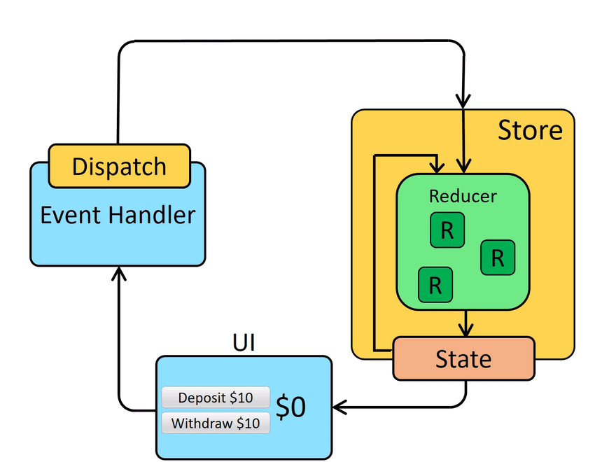

## Redux

### 什么是Redux？

在官方文档里，给出了这样一个定义

> Redux is a predictable state container for JavaScript apps. It helps you write applications that behave consistently

Redux是为Javascript应用提供一个可预测的状态容器📦

> Redux is a pattern and library for managing and updating application state, using events called "actions". 

Redux代表一种数据流模式，是一种通过“actions”的事件来管理和更新应用状态的库📚。

读到这里可能大家还是一头雾水，它应用场景是啥？为什么要用Redux？就连Redux的作者 Dan 就曾发言警告说，过早的引入Redux可能存在风险 [*You Might Not Need Redux*](https://medium.com/@dan_abramov/you-might-not-need-redux-be46360cf367)。

究其原因，主要是Redux有太多概念需要学习了，需要写很多verbose代码，并且要求你遵守某些限制。

除非

- 状态更新的逻辑异常复杂
- 状态需要频繁的更新
- 应用中内部有很多共享的状态
- 你正在构建一个较大的应用，并且有较大的团队规模

如果说上述四条没有一条满足，那么相信我，引入Redux不是一个明智的选择。

### Redux 核心概念

Redux 实际上是 Flux 的一种实现形式。

Flux 是一套处理数据的架构模式，核心特征是单向数据流， 状态的变化是可预测的。

1. View
   用户界面
2. Action
   试图层发出的信息，会触发应用状态度改变
3. Dispatcher
   分发Action
4. Store
   存储应用状态的仓库，定义修改状态的逻辑

Redux经过重新设计和改良，主要由四个核心概念组成：

1. Store：只读的单一数据源
2. Action：对变化的描述
3. Reducer：Reducer是纯函数，负责对变化进行分化和处理，把新的状态返回给Store。
4. Dispatcher：负责分发Action

Redux的工作流🌊



Redux 期望所有的状态更新都是 immutable 的。 至于为什么要 immutable 可以看看我的这篇文章 [为什么说immutable很重要](https://ruoyu.life/blog/post/study/%E4%B8%BA%E4%BB%80%E4%B9%88%E8%AF%B4immutable%E5%BE%88%E9%87%8D%E8%A6%81)


### 中间件

中间件的介入允许Dispatcher不仅可以传递一个普通action对象，还可以传递一个函数

一旦通过dispatch被传递的 value 抵达了中间件，它便可以通过异步的方式来执行，如发送AJAX请求等，等响应之后再dispatch一个action来触发reducer进行处理

换句话说，applyMiddleware会对dispatch函数进行改写，使dispatch在出发reducer之前先要对中间件进行链式调用


```JavaScript
function createThunkMiddleware(extraArgument){
    return ({dispatch,getState}) => next => action => {
        if (typeof action === 'function') {
            return action(dispatch,getState,extraArgument)
        }
        return next(action)
    }
}
```


## 结语

尽管它很火，有很多大公司都在使用 Redux， 但这不代表你的应用就需要它。凡事都需要权衡（tradeoff）。请斟酌考虑，当你花了精力，Redux 是不是真的可以给你的项目带来回报？