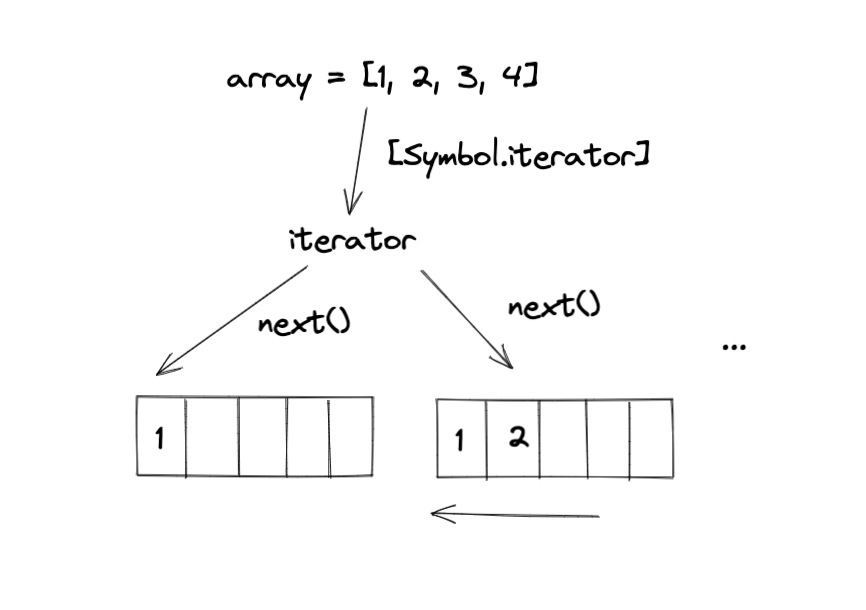

# 前言

JavaScript 单线程的，如果没有异步，页面可能会卡死，因此异步编程在 JavaScript 中显得格外重要。

传统异步解决方案有回调函数，发布订阅事件以及 Promise。而 Generator 的出现可以进一步扩充我们实现异步编程的方式。

何为异步？

- 程序中所有同步任务都会在主线程上执行，形成一个执行栈
- 然后除了主线程之外还存在一个 任务队列 task queue 其中可以细分为 micro tasks 和 macro tasks， 也就是微任务和宏任务
- 当执行斩内的同步任务执行完毕之后，会自动从任务队列中读取进栈并执行，这一过程也叫 event loop
- 程序会优先执行微任务队列的任务，清空了微任务队列之后才会继续执行任务队列

[Visualizing the javascript runtime at runtime](http://latentflip.com/loupe)


简单来说，假如我们先发送一个 Ajax 请求，在等待服务器响应的一段时间内，程序会先继续执行后面的任务，等到响应并其他同步任务执行完毕后，在接着继续执行拿到响应后的任务。

如果没有异步，那么在等待服务器响应的一段时间，整个程序就会出现假死状态，对用户的体验是极其不友好的。

回调函数是 JavaScript 最常用的异步编程方案。比如浏览器里关于事件的 API, Fetch 请求都是异步的，但会引发所谓的回掉地狱[[callback hell]](http://callbackhell.com/)

```JavaScript
const button = document.querySelector("button")
button.addEventListener('click', () => { 
   
 })
```


Promise 的出现解决了回掉地狱的问题，把回掉函数的形式转换为纵向书写的方式，但这又引发了新的问题就是造成大量verbose代码，可读性变差

```JavaScript
const promise = new Promise((resolve, reject)=> {
    setTimeout(() => resolve("done!"), 1000);
})
console.log(1)
promise.then(result => console.log(result)) // done!
console.log(2)

// 执行顺序 打印结果 1 2 done!
```

async await 语法糖的引入让我们以更优雅，同步的方式编写异步代码，这也大大增加的代码的可读性。

```JavaScript

async function getName() {
    console.log(1)
    const result = await Promise.resolve('klaus') // klaus
    console.log(result)
}
console.log(2);
getName()
console.log(3)

// 执行顺序 打印结果 2 1 klaus 3
```

然而，Async 本质上就是使用了 Generator 的语法糖， 带着知根知底的态度，我们有必要研究一下这个 Generator 究竟是什么？


# 什么是 Generator

Generator 函数是 ES6 提供的一种异步编程解决方案，常规函数只会返回一个单一值（或者不返回任何值）。而 Generator 可以按需一个接一个地返回 *yield* 多个值

在写法上，Generator 是一个带星号的"函数"，在内部，它可以通过 *yield* 关键词暂停和恢复执行

```JavaScript
function* printName() {
  yield 'hello';
  yield 'klaus';
  return 'end';
}
const gen = printName();
```

然而，对于 Generator 而言，它返回的不是函数运行的返回值，而是一个指向内部状态的迭代对象



这个迭代对象包含一个叫 next 的方法，调用后会移动内部指针的位置并停下，即下一个 yield 语句。并且，它返回一个对象，对象里 value 属性就是 yield 后面的值，done 属性为布尔类型，表明遍历是否结束(直到return语句)

```JavaScript
function* printName() {
  yield 'hello';
  yield 'klaus';
  return 'end';
}
const gen = printName();

const firstYield = gen.next() // { value: 'hello', done: false }
const secondYield = gen.next() // { value: 'klaus', done: false }
const thirdYield = gen.next() // { value: 'end', done: true }
const fourthYield = gen.next() // { value: undefined, done: true }

```

**组合调用 Generator**

除此之外，yield* 这种写法一般用在一个 Generator 里调用另一个 Generator

```JavaScript
function* printAge() {
    yield 18
}

function* printName() {
    yield 'hello'
    yield 'klaus'
    return 'end'
}

function* greeting() {
    yield* printName()
    yield* printAge()
}

const gen = greeting()

gen.next()
gen.next()
gen.next()
```

**可遍历的 Generator**

由于 Generator 是可迭代的 (iterable)，我们可以通过 `for of` 循环遍历它所有的值

```JavaScript
function* greeting() {
    yield* printName()
    yield* printAge()
}

const gen = greeting()

for (let value of gen) {
    console.log(value)
}

//  打印结果 hello klaus 18
```

⚠️ 注意，我们在 `printName` 中 return 的 `end` 值并没有被遍历出来，因此想要通过遍历方式获取值一定要用 yield 关键字的方式

当然，除了 `for of` 遍历，我们还可以使用 `...` 扩展语法(spread operator) 来转换为数组

```JavaScript
function* greeting() {
    yield* printName()
    yield* printAge()
}

const result = [...greeting()]
console.log(result) // ['hello', 'klaus', 18]
```

**带参数的 `next(arg)`**

Generator 更灵活的一点是在于，不仅可以一次一次向外界返回结果， 而且还可以将外部的值传入到 Generator 内部内。也就是所谓的 two-way-street

在我们调用 `next(arg)` 方法时候，我们就能将参数 arg 传递到 generator 内部。这个 arg 参数会变成上一个 yield 的结果

```JavaScript
function* add(first, second) {
    const result = yield first + second
    yield `The add result is : ${result}`
}

const gen = add(1, 2)

const result = gen.next().value

gen.next(result).value // The add result is : 3
```

- 第一次调用 `next()` 是不带参数的，遇到第一个 yield 计算出结果并停下， 此时应该返回 { value: 3, done: false }
- 第二次调用 `next(result)`，将上一个 `next()` 返回的结果 value 传入本次 `next(result)` 方法里
- 这个 `result` 参数将会赋值给上一个 yield 等号左侧的变量
- 程序继续执行，遇到下一个 yield，此时 `next(result)` 返回 { value: 'The add result is : 3', done: false }

----

Generator 返回的对象还有一个 `return()` 方法，可以给定返回 `value` 值，并且终结遍历函数

```JavaScript
function* add(first, second) {
    const result = yield first + second
    yield `The add result is : ${result}`
}

const gen = add(1, 2)

const result = gen.next() // { value:3, done:false }

gen.return('done') // { value:'done', done:true }
gen.next()   // { value: undefined, done: true }
```

如果 Generator 内部有 `try ... finally` 代码块，如果正在执行 `try` 代码块内的代码，`return()` 方法会直接让程序进入 `finally` 代码块进行执行，完毕后再终结

----


**异常捕获**

Generator 内部可以通过 `try ... catch` 的方式来捕获异常。同时 `throw` 方法被捕获以后，会附带执行下一条yield 表达式

```JavaScript
function* add(first, second) {
    try {
        const result = yield first + second
        yield `The add result is : ${result}`
    } catch (error) {
        console.log(error.message)
    }
    yield 'end'
}

const gen = add(1, 2)

console.log(gen.next())
const nextYield = gen.throw(new Error('Something wrong~~'))
console.log(nextYield)
console.log(gen.next())
/** 
{ value: 3, done: false }
Something wrong~~
{ value: 'end', done: false }
{ value: undefined, done: true }
**/
```

当然，如果 Generator 函数内部没有 `try ... catch` 代码块，那么throw方法抛出的错误，将被外部 `try ... catch` 代码块捕获。如果内外都没有  `try ... catch` 代码块，那么程序将报错，终止运行


不难发现，`next()` `return()` `throw()` 这三个方法本质上是在做同一件事情。就是控制 Generator 的执行权

# 异步中的 Generator

## 协程

在了解如何通过 Generator 实现异步编程之前，有必要先了解一下 Generator 的实现机制**协程** 

> 协程是一种比线程更加轻量级的存在，协程处在线程的环境中，协程既可以用单线程实现，也可以用多线程实现


一个线程可以存在多个协程。不像进程和线程，协程并不受操作系统的管理，而是被具体的应用程序代码所控制

当只有一个线程（或函数）处于正在运行的状态，其他线程（或函数）都处于暂停态（suspended）。换句话说，同一时间可以有多个线程处于运行状态，但是运行的协程只能有一个，其他协程都处于暂停状态。线程（或函数）之间可以交换执行权。在内存中，协程是同时存在多个栈，但只有一个栈是在运行状态，也就是说，协程是以多占用内存为代价，实现多任务的并行

不过，JavaScript 是单线程语言，只能保持一个调用栈。引入协程后，当任务暂停任务还可以保持自己的状态，这样做好处是抛出错误的时候，可以找到原始的调用栈

Generator 函数是 ES6 对协程的实现，它们之间使用yield表达式交换控制权。Generator 函数产生的上下文环境，一旦遇到yield命令，就会暂时退出堆栈，但是并不消失，里面的所有变量和对象会冻结在当前状态。等到对它执行next命令时，这个上下文环境又会重新加入调用栈，冻结的变量和对象恢复执行。


## 执行异步任务

```JavaScript
function* printName() {
    yield 'hello'
    const name = yield new Promise((resolve) => {
        setTimeout(() => {
            resolve('klaus')
        }, 1000)
    })
    console.log(name)
    return 'end'
}

const gen = printName()
gen.next() // { value: hello, done: false }

gen.next().value.then((data) => {
    gen.next(data)  
})

console.log('Tada')
// 打印结果 Tada klaus
```

上面代码中，Generator 函数封装了一个 `Promise` 异步操作，将异步操作表示得很简洁很想同步操作，但是流程却不方便，需要手动去执行 `then()` 并调用 `next()` 层层添加回调函数

基于上述规律，可以写一个自动执行器，只要 Generator 函数还没执行到最后一步，next 函数就调用自身，以此实现自动执行。

```JavaScript
function scheduler(gen) {
    const g = gen()
    const next = (data) => {
        const result = g.next(data)
        if (result.done) return result.value
        if (result.value.then) {
            result.value.then(data => next(data))
        } else {
            next(result.value)
        }
    }
    next()
}
```

```JavaScript
function* printName() {
   console.log('hello')
    yield 'hello'
    const name = yield new Promise((resolve) => {
        setTimeout(() => resolve('klaus'), 100)
    })
    console.log(name)
    return 'end'
}

scheduler(printName)
console.log('TADA')

// 打印顺序 hello TADA klaus
```


简单优化一下 `scheduler` 自动执行器，对异常进行处理，并返回一个 `Promise` 

```JavaScript
function scheduler(gen,args) {
    const _this = this
    return new Promise((resolve, reject) => {
        const g = gen.call(_this,args)
        if (!g || typeof g.next !== 'function') return resolve(gen)

        const next = (data) => {
            try {
                const result = g.next(data)
                if (result.done) return resolve(result.value)

                if (result.value.then) {
                    result.value.then((data) => next(data)).catch((error) => next(error))
                } else {
                    next(result.value)
                }
            } catch (error) {
                reject(error)
            }
        }
        next()
        
    })
}
```


# 结语

虽然 Generator 可以让代码的执行权交给我们来控制，但现实是它很少被使用。尤其是有了 `async await` 处理异步的方式之后，不过，有时候 Generator 也会派上用场，比如生成随机数据等


扩展阅读

[MDN--Generator](https://developer.mozilla.org/en-US/docs/Web/JavaScript/Reference/Global_Objects/Generator)

[ES6 In Depth: Generators](https://hacks.mozilla.org/2015/05/es6-in-depth-generators/)

[Generators, advanced iteration](https://javascript.info/generators-iterators)