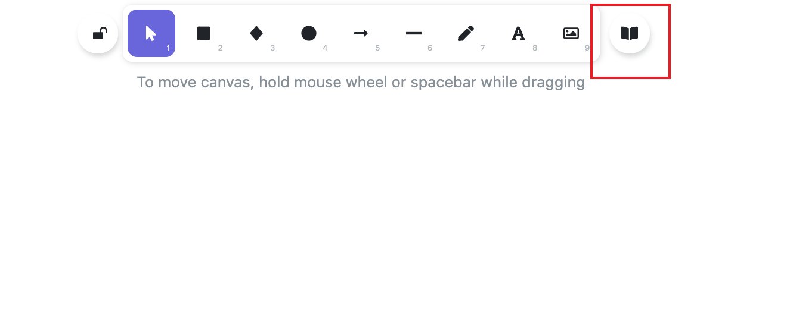
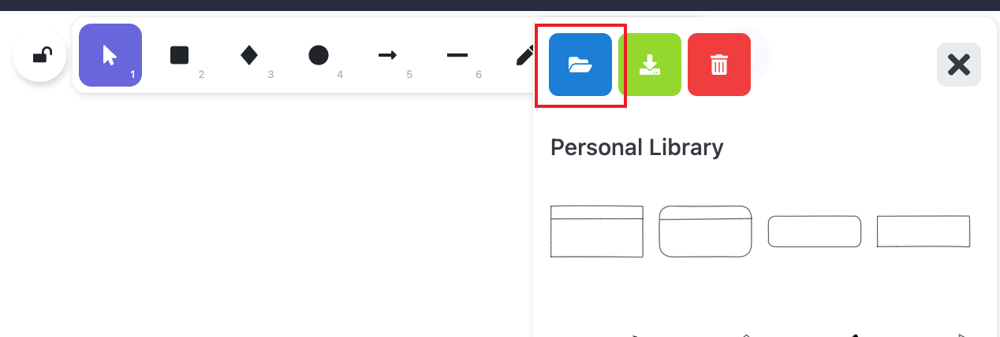

# Prefix 前言

无论是想要帮助其他人理解你的想法或者项目，还是想要记录新学习的知识，图文相比于视频无疑是既方便，又经济的输出格式。

市面上有很多画图工具，我极力推荐一款名为[Excalidraw](https://github.com/excalidraw/excalidraw)开源工具。

✍️
最喜欢的莫过于它的手绘风格，它可以通过手绘的方式创建出别具一格的图表和文字。

# VScode Extension 插件

前端开发工程师一定对VScode都不陌生。[VScode](https://code.visualstudio.com/)是微软开发的一款轻量级免费的代码编辑器，它之所以如此之火不仅仅是因为它免费轻量，我想大部分原因是它开放的插件市场，用户可以自由装载海量的插件。

由于VScode是基于`electron`开发的，因此开发一个插件的成本很低，也导致了大量鱼龙混杂的插件，如今要想找一款合适且好用的插件全靠缘分。本次推荐的这款插件就是`Excalidraw`官方开发的一款插件，然你能够在VScode中使用`Excalidraw`。

## Install 安装

在商店直接搜索`Excalidraw`，安装成功后重启VScode创建`.excalidraw`为结尾的文件即可使用。

## Add Libraries 添加社区组件

除了自己手动画图之外，还可以通过引入社区中其他人提供的组件库来减少画图的成本。

### Step 1️⃣

进入🚪[Excalidraw Libraries](https://libraries.excalidraw.com/)挑选自己喜爱的组件库。

### Step 2️⃣

选择⬇️Download，把它存入一个你喜欢的地方，比如我就把它集中放入了`xxx/document/excalidraw/library`目录下。

### Step 3️⃣

打开VScode，在任意项目下创建一个`.excalidraw`为结尾的文件并打开。选择如下图类似图书图标，然后点击倒入按钮，导入你之前下好的组件库文件即可。

# In The End 总结

Excalidraw + VScode组合的方式可以让我们与其他文件一起更集中地管理，而不是散落在各个APP中。

优势 ⭐

- 简单易上手

- JSON格式存储，便于传输和备份(这意味着你可以在任何地方使用它)

- 开放的组件库，方便使用